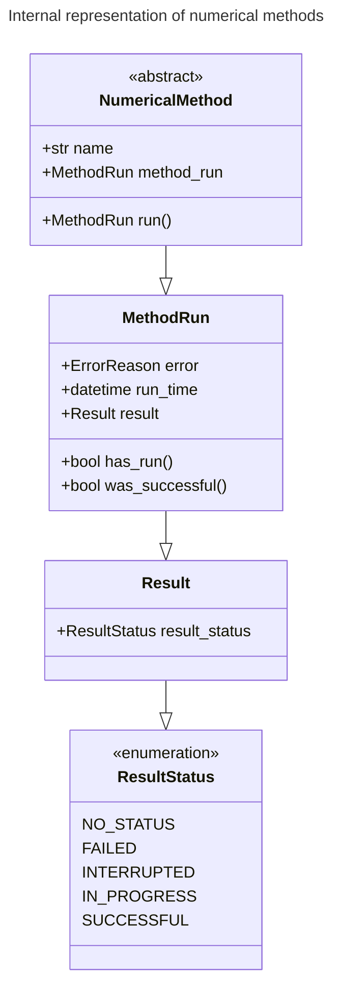
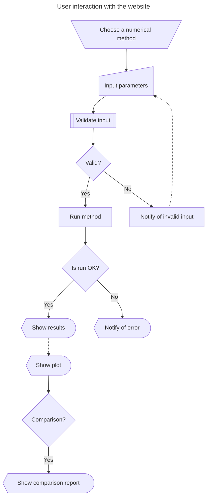

<h1>Numerical Methods</h1>

Web application for running numerical methods that solve:

1. Equations in one variable (such as the Newton–Raphson method)

2. Linear systems of equations (such as the Gauß–Seidel iterative technique)

3. As well as interpolation (such as the Lagrange interpolating polynomial)

# 1. Table of contents <!-- omit toc -->
- [1. Table of contents ](#1-table-of-contents-)
- [2. Methods we support](#2-methods-we-support)
  - [2.1. Equations in one variable](#21-equations-in-one-variable)
  - [2.2. Linear systems of equations](#22-linear-systems-of-equations)
  - [2.3. Interpolation](#23-interpolation)
- [3. Features](#3-features)
- [4. Limitations](#4-limitations)
- [5. Expected input and output formats](#5-expected-input-and-output-formats)
- [6. Methods comparison feature](#6-methods-comparison-feature)
- [7. Internal representation](#7-internal-representation)
- [8. User interaction](#8-user-interaction)
- [9. Quirks](#9-quirks)
- [10. Run](#10-run)
- [11. About this project](#11-about-this-project)
- [12. References](#12-references)
- [13. Authors](#13-authors)
- [14. Similar projects](#14-similar-projects)
  - [14.1. Former course-takers](#141-former-course-takers)
  - [14.2. On the Web](#142-on-the-web)
- [15. License](#15-license)

# 2. Methods we support

## 2.1. Equations in one variable

> … [W]e consider one of the most basic problems of numerical approximation, the
> root-finding problem. This process involves finding a root, or solution, of an
> equation of the form $f(x) = 0$, for a given function $f$. A root of this equation
> is also called a zero of the function $f$.
>
> —Burden & Faires (2011, p. 48)

1. Bisection method
2. Fixed-point iteration
3. Newton–Raphson method
4. Secant method
5. The method of false position (also known as *regula falsi*)
6. Modified Newton method for multiple roots (at least one of the following):
   1. Accounting for root multiplicity
   2. Using an auxiliary function

## 2.2. Linear systems of equations

> Direct techniques are methods that theoretically give the exact solution to
> the system in a finite number of steps. In practice, of course, the solution
> obtained will be contaminated by the round-off error that is involved with the
> arithmetic being used.
>
> —Burden & Faires (2011, p. 358)

> An iterative technique to solve the $n \times n$ linear system $A\bold{x} =
> \bold{b}$ starts with an initial approximation $\bold{x}^{(0)}$ to the
> solution $\bold{x}$ and generates a sequence of vectors
> ${\{\bold{x}^{(k)}}\}^{\infty}_{k=0}$ that converges to $\bold{x}$.
>
> —Burden & Faires (2011, p. 450)

Though the course covered direct techniques, this program only implements these
_iterative techniques_:

1. Jacobi iterative method

2. Gauß–Seidel iterative technique

3. Successive Over-Relaxation (also known as SOR)

*Note:* Our program is designed to solve systems of $2 \leq n \leq 7$.

## 2.3. Interpolation

> The problem of determining a polynomial of degree one that passes through the
> distinct points $(x_0, y_0)$ and $(x_1, y_1)$ is the same as approximating a
> function $f$ for which $f (x_0) = y_0$ and $f (x_1) = y_1$ by means of a
> first-degree polynomial **interpolating**, or agreeing with, the values of $f$
> at the given points. Using this polynomial for approximation within the
> interval given by the endpoints is called **polynomial interpolation**.
>
> —Burden & Faires (2011, p. 108)

1. Vandermonde polynomial

2. Newton's divided differences interpolation polynomial

3. Lagrange polynomial

4. Linear spline interpolation

5. Cubic spline interpolation

*Note:* Our program is designed to interpolate a maximum of 8 data points.

# 3. Features

- *User help system:* By this we mean that the program tries its best to validate
  user input and, in case of error, notify what exactly went wrong. (Instead of
  saying "yeah, this just didn't work `¯\_(ツ)_/¯`").

  For example, if a given function, a typical input, turns out _not_ to be
  continuous —if an intermediate result had an imaginary part, for instance— for
  a method that _requires_ continuity, we would notify the user.

  > "Your function might not be continuous in this interval"

- *Solution graphing:* If a solution was found, the program will graph the
  function (for methods that work with functions, naturally) around the interval
  where the solution was found. This feature helps verify the correctness of the
  program, though a visual proof is no real guarantee of correctness.

- *Methods comparison:* Each semester, our professor adds in another requirement,
  so as to discourage, nay, *avoid* blind copy-paste, or fork, of repositories
  created by students who have already taken the course.

  This semester, the "one more thing" for this project is a methods comparison
  feature. After running each method, the program runs the other methods on the
  same inputs and provides a table with relevant variables. These include the
  number of iterations, final error (be it absolute or relative), and, if found,
  a solution.

  After running all the relevant methods, the program decides which one is best
  based on criteria defined by us, the programmers.

# 4. Limitations

- *Exclusive operation on the real numbers:* We are not working with numerical
  methods that can find e.g. roots in the complex numbers. This program will not
  return answers that lie in the complex numbers (i.e. have an imaginary part).

# 5. Expected input and output formats

> [!WARNING]
>
> This section is pending.
>
> It's supposed to talk about the inputs and outputs for each section. It should
> also talk about input validation (specially for the section on linear
> systems).

# 6. Methods comparison feature

As mentioned above in § 3. Features, the methods comparison feature provides a
table with relevant variables.

For the section on *equations in one variable*, this table follows the
format (and please note that the numerical values are dummy data that might not
make sense):

| Method              | $x_{\text{sol}}$ | $n_{\text{iter}}$ | $E$     |
| ------------------- | ---------------- | ----------------- | ------- |
| Bisection           | 2.3844e-15       | 7                 | 3.1e-15 |
| Newton–Raphson      | 2.3844e-15       | 3                 | 3.0e-15 |
| _and other methods_ | …                | …                 | …       |

If a method works on an initial value, instead of an interval, the program
sets up an interval to work with, and vice versa.

---

For the section on *iterative techniques to solve linear systems*, this table
follows the format (and note the same caveat as indicated above):

| Method      | $n_{\text{iter}}$ | $x_1$      | $x_2$ | …   | $x_n$ | $E$     |
| ----------- | ----------------- | ---------- | ----- | --- | ----- | ------- |
| Jacobi      | 10                | 2.3844e-15 | …     | …   | …     | 5.1e-11 |
| Gauß–Seidel | 5                 | 2.3344e-15 | …     | …   | …     | 3.0e-14 |
| SOR₁        | 4                 | 2.3444e-15 | …     | …   | …     | 4.0e-12 |
| SOR₂        | 6                 | 2.3544e-15 | …     | …   | …     | 3.3e-13 |
| SOR₃        | 2                 | 2.3944e-15 | …     | …   | …     | 4.2e-16 |

Where SOR has three methods that correspond to three arbitrary values, chosen by
us, the programmers, of the $\omega$ weight for SOR methods. Ideally, these
would be close to 1.

# 7. Internal representation

# 8. User interaction

# 9. Quirks

> [!WARNING]
>
> This section is pending.
>
> It's meant to state any problems that we or the professor find in our project.

# 10. Run

> [!WARNING]
>
> This section is incomplete.
>
> It's meant to explain how to setup and run the website, as well as any
> requirements (operating system, memory, other programs, environment variables,
> etc.)

# 11. About this project

This is the course project for the course "Análisis numérico" (ST0256) taught by
professor Julián Esteban Rendón-Roldán at EAFIT University in Medellín,
Colombia.

# 12. References

1. Burden, Richard L., and J. Douglas Faires. Numerical Analysis. 9. ed.,
   International ed, Brooks/Cole, 2011.

   Course textbook. Chapter 2 covers solutions of equations in one variable.
   Chapters 6 and 7 cover direct and iterative methods, respectively, for
   solving linear systems. Chapter 3 covers interpolation.

2. Correa Zabala, Francisco José. Métodos numéricos. 2010. 1st ed., Fondo
   Editorial Universidad Eafit, 2018.

   Another course textbook. This one doesn't get mentioned too often, but it's
   the basis material for the course slides.

# 13. Authors

Luis Miguel Torres Villegas.

# 14. Similar projects

## 14.1. Former course-takers

1. [nceballosp/Analisis-Numerico](https://github.com/nceballosp/Analisis-Numerico).
   Python + Flask and Vite + React.

2. [isabelmorar/AnalisisNumerico](https://github.com/isabelmorar/AnalisisNumerico).
   Python + Django.

3. [EAZ-EAFIT/Moscow-Mathematical-Papyrus](https://github.com/EAZ-EAFIT/Moscow-Mathematical-Papyrus).
   Python + Streamlit.

4. [alejoriosm04/NumeriSketch](https://github.com/alejoriosm04/NumeriSketch). Python + Django.

## 14.2. On the Web

1. [AtoZmath.com - Numerical methods calculators](https://atozmath.com/Menu/ConmMenu.aspx)

# 15. License

Copyright 2025 The Authors.
